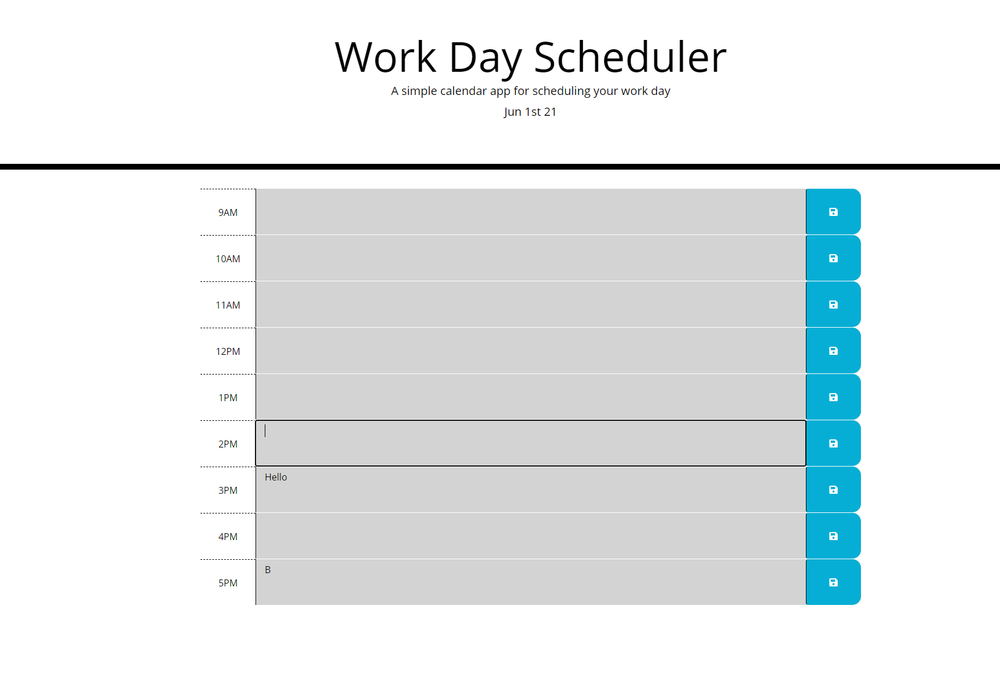

# Daily Planner

Picture: 

Deployed URL: https://mliemann.github.io/DailyPlanner-/

## What is does:

GIVEN I am using a daily planner to create a schedule
WHEN I open the planner
THEN the current day is displayed at the top of the calendar
WHEN I scroll down
THEN I am presented with timeblocks for standard business hours
WHEN I view the timeblocks for that day
THEN each timeblock is color coded to indicate whether it is in the past, present, or future
WHEN I click into a timeblock
THEN I can enter an event
WHEN I click the save button for that timeblock
THEN the text for that event is saved in local storage
WHEN I refresh the page
THEN the saved events persist

## Technologies Used
* JavaScript (jquery)
* CSS 
* HTML
  
## Author
* Marlon Liemann mliemann@live.com

## Licenses
* MIT
    
